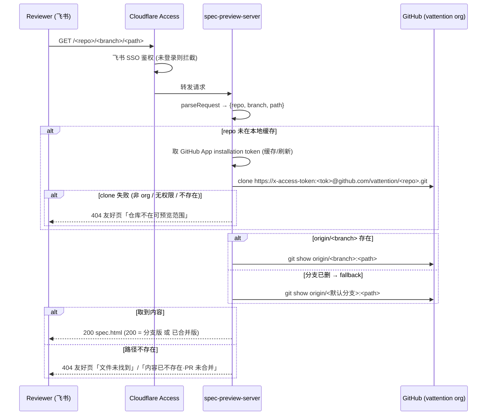

# Spec Preview: Durable Links + Org-wide Zero-config Repos

## §1 产品视角（owner: PM）

### 产品逻辑

spec-ratifier 会为每个待评审的 L2 spec 生成一条内网预览链接（`spec.html`，经 Cloudflare Access / 飞书 SSO 暴露），发到飞书卡片里让非研发 reviewer 阅读渲染版。当前实现暴露两个问题：

1. **仓库绑定**：预览 server 需要逐仓库手动 onboard（加只读 deploy key → 在 `/var/lib/specs/<repo>` clone → 改 `SPEC_PREVIEW_REPOS` env → 重启）。实际只注册了 `facio-blueprint`，导致放在各自项目 repo 下的 spec 无法预览（`repo not configured`）。但团队期望 spec 通常放在各自项目 repo 下。
2. **分支删除后链接失效**：预览 URL 把 PR 分支名嵌进路径，server 执行 `git show origin/<branch>:<path>`。一旦 PR 合并 + 分支删除，`origin/<branch>` 不存在 → 返回 410 `branch not found`。而 `review_requested` 时发到飞书卡片里的就是这条 branch URL，合并后该历史链接永久失效。

本变更让预览链接成为「可达且持久」的资产：org 内任意 repo 零配置可预览，且链接在分支删除/合并后仍然有效。

> 需求来源：Flow context `2026-05-28-spec-html-内网预览仓库绑定--分支删除后链接失效`（status: decided）。

### 用户旅程

1. 研发在**任意 `vattention` org repo** 内跑 spec-ratifier，生成 spec.html 并 push 到 PR 分支；卡片带预览链接发到飞书。
2. reviewer 点链接 → 飞书 SSO → 看到渲染版 spec.html（该 repo 此前**从未**在 server 上手动 onboard 过）。
3. spec 被 ratify、PR 合并、分支删除。
4. 数日后另一位同事翻到当初那条飞书卡片，点**同一条链接** → 仍然看到该 spec 的**已合并最新版**内容（而非 410）。
5. 若 spec 对应 PR 被关闭（未合并）且分支已删，reviewer 点链接 → 看到一条友好提示（内容已不存在 / PR 未合并），而非裸 410。

### 验收标准（AC）

- [ ] AC-1：reviewer 经飞书 SSO 点卡片链接，能渲染出 feature 分支上的 spec.html（review 期 happy path）。
- [ ] AC-2：PR 合并 + 删分支后，点**当初卡片里的同一条链接**仍能看到该 spec 的已合并最新版内容，不再出现 410。
- [ ] AC-3：org 内一个从未手动 onboard 的 repo，作者跑 spec-ratifier 生成的链接可直接预览，无需管理员加 deploy key / clone / 改 env / 重启。
- [ ] AC-4：org 外 / server 无读权限的 repo，访问预览链接时给出清晰提示（"该仓库不在可预览范围"），而非困惑报错。
- [ ] AC-5：链接指向的 spec 文件路径不存在时给出清晰 404（指明文件未找到），不暴露内部细节。
- [ ] AC-6：PR 未合并即关闭且分支被删时，给出友好提示（内容已不存在 / PR 未合并），而非裸 410。
- [ ] AC-7：以上所有链接仍须经飞书 SSO（Cloudflare Access）鉴权；新能力不得绕过鉴权。

## §2 设计视角（owner: 设计师）

### 风格 / 设计规范引用

无新视觉产出。沿用 `generate-spec-html` v2 生成的 spec.html 既有样式体系（markdown-it + shiki + 既有 CSS），不引入新 design token。

### 关键交互

唯一面向人的视觉面是 server 的**错误/降级页面**。当前为 plain-text（`410 ...` / `404 ...`）。本变更将面向非研发 reviewer 的几类终态渲染为**极简友好 HTML 页**（内联样式，与 spec.html 视觉气质一致，纯静态、无脚本）：

- 内容已不存在 / PR 未合并（对应 AC-6）
- 该仓库不在可预览范围（对应 AC-4）
- 文件未找到（对应 AC-5）

文案 tone：中文、简洁、给出下一步建议（如"该 spec 的分支可能已合并并删除；请向作者索取最新链接或查看 PR"）。`/healthz` 等机器端点保持 plain-text 不变。

### 视觉产物

无 Figma。错误页为纯文字卡片式布局，实现时在 §3 落地，无需独立设计稿。

## §3 研发视角（owner: 研发）

### 技术架构

两个问题都在 **server 侧**解决；`spec-ratifier` 的 URL 格式（`BASE/<repo>/<branch>/<path>`，`repo = basename(git toplevel)`）已天然支持任意 repo/branch，故 skill 侧几乎无需改动。

### 复杂模块拆解

- **GitHub App token 模块（新）**：用 `GITHUB_APP_ID` + PEM 私钥（`node:crypto` RS256 签 JWT，**保持零 npm 依赖**）+ `GITHUB_APP_INSTALLATION_ID` 换取 installation access token（`contents:read`，~1h TTL），进程内缓存并在过期前刷新。换 token 走 `node:https`（GitHub REST `POST /app/installations/{id}/access_tokens`）。
- **按需 provision（新）**：`ensureRepo(name)` —— 缓存目录 `/var/lib/specs/<name>` 不存在则用 token clone `https://x-access-token:<tok>@github.com/<GITHUB_ORG>/<name>.git`。用 in-flight Promise map 去重并发 clone。clone 失败（非 org repo / 无权限）→ 标记为 not-in-scope，返回 AC-4 友好页。org 由 `GITHUB_ORG`（默认 `vattention`）固定。
- **`gitShow` 增加默认分支 fallback**：`origin/<branch>` rev-parse 失败时，回退到默认分支（`git symbolic-ref refs/remotes/origin/HEAD`，缺省回退 `GITHUB_DEFAULT_BRANCH=main`）取同路径文件。区分三种终态：分支版命中 / 已合并版命中（fallback）/ 都没有（AC-6 友好页）。
- **`refreshAll` 改为动态集合**：后台 `git fetch` 循环遍历当前**已缓存**的 repo 集合（运行期增长），而非静态 `SPEC_PREVIEW_REPOS` map。
- **配置迁移**：`SPEC_PREVIEW_REPOS` 由必填降为**可选预热/allowlist**；新增 `GITHUB_ORG` / `GITHUB_APP_ID` / `GITHUB_APP_PRIVATE_KEY`(或路径) / `GITHUB_APP_INSTALLATION_ID`。`install.sh` 与 systemd env 相应调整（用 App 凭证替代逐 repo deploy key）。

### Test plan 骨架

- 单测（`services/spec-preview-server/server.test.mjs` 扩展，`npm run test:server`）：
  - 既有 `parseRequest` / `safeComponent` 保持通过。
  - 新增：repo name 校验（拒绝注入 / 非法字符）、默认分支 fallback 的分支选择逻辑（mock `execFile`）、JWT claim 结构（iss/iat/exp）。
- 集成：用本地 **bare git 仓库 fixture** 起 server —— ① 请求存在的分支+路径 → 200；② 删该分支后请求同 URL → fallback 到默认分支 → 200 已合并版；③ 默认分支也无该文件 → AC-6 友好页；④ 未知 repo（provision 失败 mock）→ AC-4 友好页。
- e2e：经 Cloudflare Access 的真实链路为手动验证（写入 README runbook），不做自动化。

### 风险点

- **安全（主要）**：org 级读凭证比逐 repo deploy key 影响面大。缓解：仅 `contents:read`、短期自动轮换的 installation token、暴露面仅 Cloudflare Access + 内网 EC2、私钥 `chmod 600` 且不入库。权衡见 §4。
- **磁盘增长**：按需 clone 会让缓存目录随被访问 repo 增长。本期可接受（LRU 驱逐见 §4 deferred）。
- **首访延迟**：未缓存 repo 首次请求需 clone（秒级）；后续命中缓存 + 后台 fetch 保温。
- **token 失败降级**：App token 取不到时，若 `SPEC_PREVIEW_REPOS` 预热过的 repo 仍可服务；否则返回友好 503。
- **并发 clone 竞态**：in-flight Promise 去重。
- **跨平台/注入**：复用既有 `safeComponent` + `filePath.includes('..')` 守卫；clone URL 中 token 不写日志。

## §4 Cross-viewpoint Open Issues

- [ ] **运维前置**：GitHub App 的创建 / 安装到 `vattention` org / 私钥下发由谁负责（一次性 ops 任务）—— 实施前需确认 owner。
- [ ] **默认分支探测**：依赖 `origin/HEAD` symbolic-ref（clone 时写入）还是显式 `GITHUB_DEFAULT_BRANCH` 配置兜底？倾向前者 + main 兜底。
- [ ] **`SPEC_PREVIEW_REPOS` 去留**：决定保留为可选预热/allowlist（org-wide 为默认行为），还是彻底移除。倾向保留为可选预热。
- [ ] **缓存驱逐**：clone 缓存的 LRU / 容量上限是否本期做？倾向 deferred（先上无上限，观察磁盘）。

## §5 L1 Impact

> ⚠️ 本节描述的 L1 capability spec 变更**不进入 tasks.md**——由 `l1-updater` 在 PR merge 后应用。

### Affected capabilities

None —— 本仓库 `facio-superpowers` 是 harness 源码仓，未安装 harness 自身的 `docs/reference/capabilities/`（该目录不存在）。本变更不涉及任何 L1 capability spec。

### ADDED Requirements

None

### MODIFIED Requirements

None

### REMOVED Requirements

None

### ADDED Scenarios

None

## §6 Pipeline Tier

**决策**：Large

**Rationale**：

- 决策树命中 **安全 / 权限相关**（yes）：引入 org 级读凭证（GitHub App，`contents:read`），凭证影响面较逐 repo deploy key 显著扩大 → 直接判为 Large。
- 同时触及内网基础设施服务（`spec-preview-server`）的部署/凭证模型，需研发 owner + 安全视角重点评审。
- 未命中"跨产品契约改动 / breaking L1 / DB migration / 新公开 API surface"，但**安全项一票判 Large** 已足够。

## §7 Doc Impact

> ⚠️ 列出本变更预期影响的**非 L1**文档。

### 受影响文档

- `services/spec-preview-server/README.md` —— 重写部署（GitHub App 凭证、取消逐 repo onboard）、运维、Troubleshooting（410 → 现为合并后 fallback 行为；新增 org repo 自动可达说明）。
- `services/spec-preview-server/deploy/install.sh` —— 改为配置 GitHub App 凭证而非逐 repo deploy key + 静态 `SPEC_PREVIEW_REPOS`。
- `services/spec-preview-server/systemd/spec-preview-server.service` / env 文件 —— 新增 App 凭证相关 env。
- `skills/spec-ratifier/SKILL.md` —— Step 3.5A 的 Note 与 Failure-modes 表（合并后不再预期 410；删除"需先 onboard repo"的隐含假设）。
- `RELEASE-NOTES.md` —— 新版本条目。

### 不影响的明确声明

- `CLAUDE.md` / `CLAUDE-TEAM.md` - 不需要
- `.harness/*` - 不需要（此 repo 非 harness-installed）
- `docs/reference/*` - 不需要（此 repo 无知识库目录）

## §K Knowledge References

None —— `facio-superpowers` 为 harness 源码仓，无 `docs/reference/` 知识库；本变更的关键决策（server 侧 fallback 到默认分支、GitHub App org 级 `contents:read` 按需 clone）已在 §3 内联记录。frontmatter `references` 为空与此一致。
