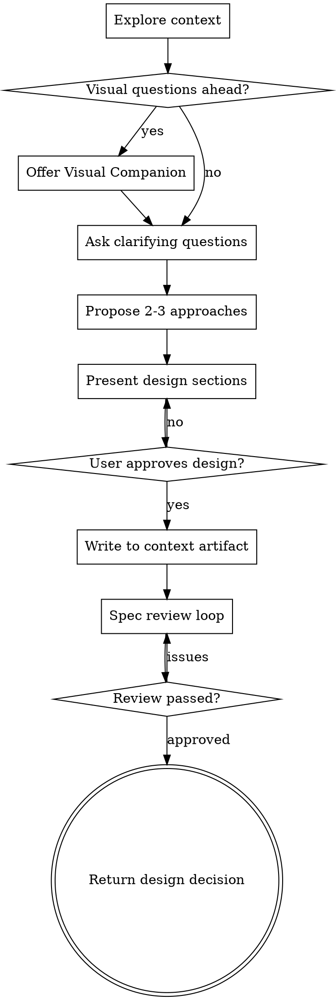

# Flow Brainstorming

Lightweight brainstorming for facio-flow contexts. Guides discussion through clarification and design, then saves output as context artifacts.

**Key difference from superpowers:brainstorming:**
- Does NOT write spec files to `docs/superpowers/specs/`
- Does NOT invoke writing-plans at the end
- DOES write design to context artifact via `manage_artifact(type="spec")`
- DOES return design decision for flow skill to call `context_decide`

## When to Use

This skill is called by the flow skill during context discussions. Do not invoke directly - use `/flow` instead.

---

## Phase Awareness (Important)

**Context phase is requirements discussion, NOT technical design.** Determine phase by context status:

| Context Status | Phase | Role | Discussion Focus |
|----------------|-------|------|------------------|
| open | Requirements | Product Manager | User scenarios, scope, acceptance criteria |
| decided | Pending claim | - | Requirements locked, awaiting development |
| claimed | Development | Engineer | Technical approach, architecture, implementation |

### Requirements Phase (open status) - DO NOT

- Discuss specific technical solutions (frameworks, libraries)
- Discuss architecture (component design, data flow)
- Discuss implementation details (API design, data structures)
- Explore codebase for technical approaches

### Requirements Phase (open status) - DO

- Clarify user scenarios: "When would a user use this?"
- Define scope boundaries: "What cases should this support? Not support?"
- Define acceptance criteria: "What counts as success?"
- Explore user value: "What problem does this solve for users?"

---

## Checklist (Requirements Phase)

**For open status contexts.** Complete these steps:

1. **Understand background** - read context description, understand the discussion origin
2. **Clarify scenarios** - ask about user scenarios, one question at a time
3. **Define boundaries** - confirm what to support and what not to support
4. **Define acceptance criteria** - output "what counts as success" checklist
5. **Write test-cases artifact** - call `manage_artifact(type="test-cases")`
6. **Return decision** - output requirements summary for flow skill to call `context_decide`

**Note:** Requirements phase does not discuss technical solutions or explore codebase.

## Process Flow



**Terminal state:** Return design decision. Do NOT invoke writing-plans or any implementation skill.

## The Process (Requirements Phase)

### Understanding the Idea

- Read context background description
- Ask questions one at a time to refine the idea
- Prefer multiple choice questions when possible
- Focus on: purpose, constraints, success criteria

### Clarifying Scenarios

- Ask about specific use cases: "When would users use this?"
- Confirm boundary cases: "Should this support X?"
- Understand user expectations: "What result does the user expect?"

### Defining Acceptance Criteria

- List "what counts as success" checklist
- Each criterion should be verifiable
- Cover: happy path, edge cases, error handling UX
- Do NOT include technical implementation details

### Writing test-cases Artifact

After user confirms acceptance criteria:

```typescript
// Call MCP tool to save test cases
manage_artifact({
  contextId: "<current-context-id>",
  action: "add",
  type: "test-cases",
  content: "<acceptance criteria and test cases markdown>"
})
```

**Important:** Get contextId from conversation context. The flow skill provides it when invoking this skill.

## Termination: Return Design Decision

**CRITICAL:** This skill does NOT invoke writing-plans or any implementation skill.

After spec review passes, output a structured decision block:

```markdown
---
## Design Decision Summary

**Decision:** [One sentence summary of the chosen approach]

**Rationale:** [Why this approach was chosen]

**Key Design Points:**
- [Point 1]
- [Point 2]
- [Point 3]

**Rejected Alternatives:**
- [Option A]: [Why rejected]
- [Option B]: [Why rejected]

---
FLOW_BRAINSTORMING_COMPLETE
```

The `FLOW_BRAINSTORMING_COMPLETE` marker signals to the flow skill that brainstorming is done and it should call `context_decide` with the above information.

## Key Principles

- **One question at a time** - Don't overwhelm with multiple questions
- **Multiple choice preferred** - Easier to answer than open-ended
- **YAGNI ruthlessly** - Remove unnecessary features from designs
- **Explore alternatives** - Always propose 2-3 approaches
- **Incremental validation** - Get approval before moving on
- **Artifact over files** - Use `manage_artifact`, not file writes
- **No implementation** - Never invoke writing-plans or write code
