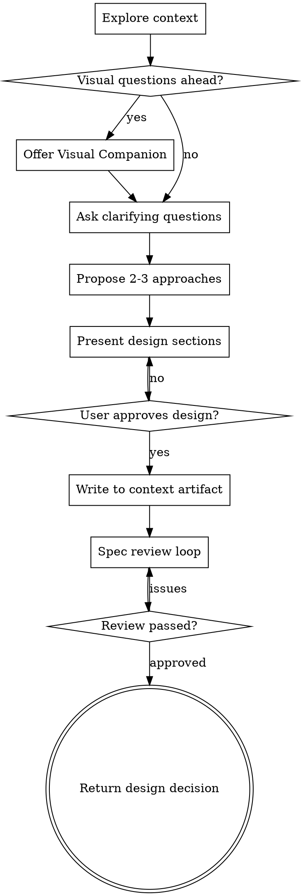

# Flow Brainstorming

Lightweight brainstorming for facio-flow contexts. Guides discussion through clarification and design, then saves output as context artifacts.

**Key difference from superpowers:brainstorming:**
- Does NOT write spec files to `docs/superpowers/specs/`
- Does NOT invoke writing-plans at the end
- DOES write design to context artifact via `manage_artifact(type="spec")`
- DOES return design decision for flow skill to call `context_decide`

## When to Use

This skill is called by the flow skill during context discussions. Do not invoke directly - use `/flow` instead.

## Checklist

You MUST create a task for each of these items and complete them in order:

1. **Explore context** - check relevant files, docs, understand the scope
2. **Offer visual companion** (if topic involves visual questions) - own message, not combined
3. **Ask clarifying questions** - one at a time, understand purpose/constraints/success criteria
4. **Propose 2-3 approaches** - with trade-offs and your recommendation
5. **Present design** - in sections scaled to complexity, get user approval
6. **Write to context artifact** - call `manage_artifact(contextId, action="add", type="spec", content=design)`
7. **Spec review loop** - dispatch reviewer subagent, fix issues until approved
8. **Return design decision** - output structured decision for flow skill to call `context_decide`

## Process Flow



**Terminal state:** Return design decision. Do NOT invoke writing-plans or any implementation skill.

## The Process

### Understanding the Idea

- Check current context (files, docs, recent commits)
- Ask questions one at a time to refine the idea
- Prefer multiple choice questions when possible
- Focus on: purpose, constraints, success criteria

### Exploring Approaches

- Propose 2-3 different approaches with trade-offs
- Lead with your recommended option
- Explain reasoning for recommendation

### Presenting the Design

- Scale each section to its complexity
- Ask after each section whether it looks right
- Cover: architecture, components, data flow, error handling
- Be ready to go back and clarify

### Writing to Context Artifact

After user approves the design:

```typescript
// Call MCP tool to save design as artifact
manage_artifact({
  contextId: "<current-context-id>",
  action: "add",
  type: "spec",
  content: "<full-design-markdown>"
})
```

**Important:** Get contextId from the conversation context. The flow skill provides it when invoking this skill.

### Spec Review Loop

After writing the artifact:

1. Dispatch spec-document-reviewer subagent with artifact content
2. If issues found: fix artifact via `manage_artifact`, re-dispatch
3. If loop exceeds 5 iterations: surface to human
4. When approved: proceed to return decision

## Termination: Return Design Decision

**CRITICAL:** This skill does NOT invoke writing-plans or any implementation skill.

After spec review passes, output a structured decision block:

```markdown
---
## Design Decision Summary

**Decision:** [One sentence summary of the chosen approach]

**Rationale:** [Why this approach was chosen]

**Key Design Points:**
- [Point 1]
- [Point 2]
- [Point 3]

**Rejected Alternatives:**
- [Option A]: [Why rejected]
- [Option B]: [Why rejected]

---
FLOW_BRAINSTORMING_COMPLETE
```

The `FLOW_BRAINSTORMING_COMPLETE` marker signals to the flow skill that brainstorming is done and it should call `context_decide` with the above information.

## Key Principles

- **One question at a time** - Don't overwhelm with multiple questions
- **Multiple choice preferred** - Easier to answer than open-ended
- **YAGNI ruthlessly** - Remove unnecessary features from designs
- **Explore alternatives** - Always propose 2-3 approaches
- **Incremental validation** - Get approval before moving on
- **Artifact over files** - Use `manage_artifact`, not file writes
- **No implementation** - Never invoke writing-plans or write code
