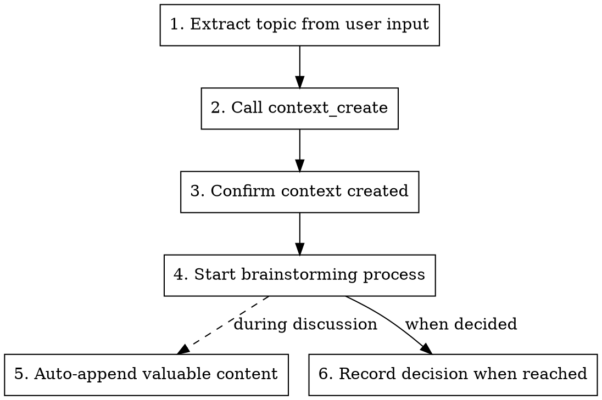

# Starting a Tracked Discussion

## Overview

Explicitly start a facio-flow tracked discussion with structured brainstorming. Creates a context for recording, then guides discussion through the brainstorming process.

Use this when you want to ensure a discussion is recorded and properly structured.

## When to Use

- Want to discuss a feature, requirement, or technical decision
- Planning refactoring or architecture changes
- Any work that benefits from recorded discussion history
- AI didn't automatically offer to create a context
- You want explicit control over when tracking starts

## Process



**Step 1: Extract Topic**
- Parse the topic from user's `/flow` invocation
- If no topic provided, ask: "What would you like to discuss?"

**Step 2: Create Context**
- Call `context_create` MCP tool:
  - `title`: The discussion topic
  - `description`: Brief background (ask user if unclear)

**Step 3: Confirm Creation**
- Tell user: "Created context [title]. Discussion will be recorded."

**Step 4: Start Brainstorming**

**IMPORTANT:**
- You MUST use the Skill tool to invoke `superpowers:brainstorming` for the discussion process
- Do NOT enter Claude Code's built-in plan mode (EnterPlanMode)
- The brainstorming skill provides the structured discussion flow - use it, don't skip it

**During Discussion:**
- Valuable content (analysis, comparisons, evaluations) → auto `context_append`
- When user decides ("就这样", "选方案A") → `context_decide`

## Examples

```
User: /flow 用户头像功能
→ Creates context → Starts brainstorming: "Let me understand the context first..."

User: /flow refactor authentication module
→ Creates context → Starts brainstorming: "What's driving this refactor?"

User: /flow
→ Asks "What would you like to discuss?"
```

## Integration

| Component | Role |
|-----------|------|
| `/flow` | Explicit trigger + context creation |
| `brainstorming` | Structured discussion process |
| `context_append` | Auto-records valuable content |
| `context_decide` | Records final decision |
| CLAUDE.md rules | Guides when to append/decide |

## Key Points

- **Explicit trigger**: 100% reliable context creation
- **Structured process**: Brainstorming ensures quality discussion
- **Auto-recording**: Valuable content captured without manual effort
- **Team visibility**: Context available for handoff and review
