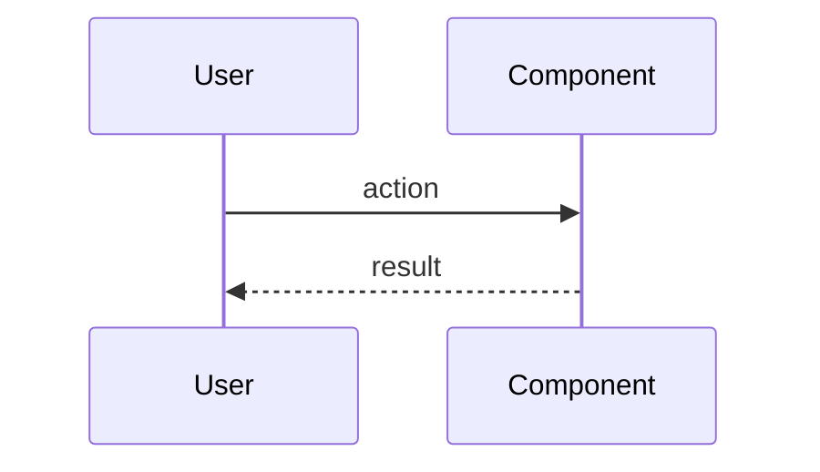

# Spec Author（L2 起草）

**Announce at start:** "I'm using the spec-author skill to draft an L2 per-change spec."

spec-author 把一个具体变更 idea 落成可被 spec-ratifier 评审、被 writing-plans 消费的结构化 L2 spec。产物写入宿主 repo 解析出的 `$SPEC_DIR/<YYYY-MM-DD>-<slug>.md`（dual-artifact，同步生成 `.html`）。

## When to use this skill

- 用户已经说出"做 xxx 功能"、"起 spec"、"走重路径"，并能勾出 ≥2 个产品/设计/研发约束 → 直接起草
- 用户说"我想做 xxx"但缺约束 → 走 Step 1 `wrap brainstorming`
- Flow Skill HARD-GATE 检测到 cwd 有 draft spec.md → resume Step 2 起继续编辑
- Flow Skill HARD-GATE 检测到用户引用 ratified spec → **不**触发本 skill；走 writing-plans

## When NOT to use

- 用户想"探索/讨论某个想法" → 走 flow-brainstorming（轻路径）
- 单行 typo / 文案微调 / 配置开关 → 走 context_create + 直接 PR（Micro tier 不一定需要 L2 spec）
- 已有 ratified L2 spec → 走 writing-plans

<HARD-GATE>
On entry, you MUST follow the Checklist below in order. Do NOT invoke 
writing-plans, executing-plans, or any implementation skill from this skill — 
those run AFTER spec-ratifier has transitioned status to `ratified`.

You MUST run Step 15 (self-review) before exiting this skill, even on resume.

When Step 1 invokes brainstorming, brainstorming's terminal hint says "invoke 
writing-plans". Ignore that hint. Return to spec-author Step 2 and restructure
brainstorming output into the L2 three-viewpoint format. This is enforced by 
spec-author, not by brainstorming — the fork hygiene rule is "don't modify 
upstream skills" (see facio-superpowers/CONTRIBUTING-FORK.md).
</HARD-GATE>

## Checklist

You MUST create a TodoWrite task for each step and complete in order:

1. **Step 0** — Knowledge catalog query (progressive disclosure entry)
2. **Step 1** — Intent gate: skip brainstorming or wrap it
3. **Step 2** — Clarify three-viewpoint constraints (product / design / engineering)
4. **Step 3** — Choose Pipeline Tier via decision tree (§7.1 of blueprint spec)
5. **Step 4** — Write spec.md with the L2 template (frontmatter + §1–§7 + §K)
6. **Step 5** — Knowledge extraction: draft 0–N notes into `docs/reference/<type>/`
7. **Step N (= 14)** — Generate spec.html via `scripts/generate-spec-html.mjs`
8. **Step 15** — Run 15-item self-review and append checklist report

After Step 15, hint chain to **spec-ratifier**. Do NOT chain to writing-plans 
(that happens via Flow Skill HARD-GATE only after status = `ratified`).

## Path Resolution · Host Repo Rules First

Before Step 0, resolve the host repo root and bind `SPEC_DIR`. All later steps
MUST use `$SPEC_DIR/<YYYY-MM-DD>-<slug>.md`; do not write directly to
`docs/superpowers/specs/` unless resolution falls back there.

Resolution order:

1. Find host root with `git rev-parse --show-toplevel` from the current cwd /
   target repo. If the user supplied a target repo, run resolution there.
2. If `.harness/config.env` defines `FACIO_SPEC_DIR`, use that relative path.
3. Read host documentation rules first: `AGENTS.md`, `CLAUDE.md`, `docs/README.md`,
   and relevant directory READMEs. If they explicitly name a current spec
   location, use that. Project rules override the superpowers harness default.
4. If no explicit rule exists, prefer an existing repo-local spec directory in
   this order: `docs/specs/`, `specs/`, `docs/superpowers/specs/`.
5. If still unresolved, fallback to `docs/superpowers/specs/` and say so in the
   chat output.

Record the chosen path once:

```bash
SPEC_DIR="<resolved-relative-dir>"
SPEC="$SPEC_DIR/<YYYY-MM-DD>-<slug>.md"
```

When the host rule is product-scoped, such as `{product}/specs/`, substitute the
Flow context product id before writing. Create `$SPEC_DIR` if it does not exist.

## Step 0 · Knowledge Catalog Query

**Why first:** L2 spec 起草应该被既有知识引导，不是从零开始。读 catalog（map，不扫目录）—— ≤150 行，远低于扫 `docs/reference/` 全树。**AI 永远读 catalog**（spec §6.3）。

**Inputs:** 当前 working dir / Flow context 的 product repo

**Actions:**

1. 找 product repo 的 `docs/reference/catalog.md`：
   - 若 cwd 在 product repo → 直接读
   - 若在 blueprint / superpowers → list_products 找当前产品的 path → 读其 catalog
   - 若 catalog 不存在 → 跳过（视为空 catalog），但报告"⚠️ catalog 缺失，建议先 init harness"
2. 按当前 idea 的关键词 / tag 匹配 catalog 行：取 top ≤5 候选
3. 按每条候选的 ID 加载完整 note（`docs/reference/<type>/<file>.md`）
4. 把加载的 notes 摘要打印给用户："我在 §K 中会引用这 N 条 notes，请确认相关性"
5. 用户可在此 prune（去掉不相关）或追加（"还有一条 K-... 也相关"）

**Output (内部状态):** 一个 `loaded_refs: K-id[]` 列表，供 Step 4 §K 章节 + Step 15 self-review 第 15 项使用。

**关键约束（spec §6.4 A5 决策）：**

- §K body 写 markdown link + 描述性 context（≥ 1 句）—— 这是 truth
- frontmatter `references: [K-id, ...]` 镜像 §K，是 CI cross-check（不是 truth）
- references 只能 **一层深**（不在 note 里再嵌套链接到其它 note）

**Anti-pattern：** 不要 `grep -r 'pattern' docs/reference/` —— 扫目录违反 progressive disclosure；catalog 才是入口。

## Step 1 · Intent Gate (skip or wrap brainstorming)

**Decision tree:**

```
input: 用户 message + Step 0 加载的 refs

if 用户已说 "做 <thing>" / "起 spec for <thing>" AND 能勾 ≥2 个明确约束:
    → 跳过 brainstorming，Step 2 直接起草
elif 用户说 "我想做 <vague>" / 缺约束 / Step 0 找不到相关 refs 暗示需求新颖:
    → wrap brainstorming（见下方）
else:
    → 一次性问 "你已经有 3 个视角的初步想法吗？还是想先讨论清楚？"
    → 用户回答后回到 if/elif
```

**Wrap brainstorming 子流程：**

1. invoke Skill(brainstorming)
2. brainstorming 完成后会说 "I'm using the writing-plans skill" / "invoke writing-plans" —— **忽略**
3. 收集 brainstorming 产出的 design doc（在 `$SPEC_DIR/<date>-<topic>-design.md`）
4. 回到本 skill Step 2，把 design doc 拆解成 L2 三视角：
   - design doc → §1 产品视角（"产品逻辑" + "用户旅程"）
   - design doc 的"approaches/trade-offs" → §3 研发视角"技术架构"
   - design doc 的 open questions → §4 Cross-viewpoint Open Issues
5. brainstorming 的 design doc 可保留（作 audit source），但 **L2 spec 是 truth**

<HARD-GATE>
After brainstorming returns control: 
- Do NOT proceed to Step 2 by simply renaming the design doc. 
- You MUST restructure into the L2 three-viewpoint template (§1/§2/§3) — 
  brainstorming's output is generic and lacks the viewpoint separation.
- Do NOT invoke writing-plans here. writing-plans runs only after status=ratified.
</HARD-GATE>

**Output:** 准备好的"三视角 raw material"（mentally / scratch notes），驱动 Step 2 的 clarifying questions。

## Step 2 · Clarify Three-Viewpoint Constraints

按视角一次问一组（不要混在同一 question）。Multiple choice 优先。

**§1 产品视角（owner: PM）：**
- 目标用户 / scenario？
- 单个 user journey 是什么？画出 3-5 步
- AC（可测试）：列 3-7 条 "用户能..."

**§2 设计视角（owner: 设计师）：**
- 引用现有 design token / system（不发明新 token）
- 关键交互（gesture / state transition）
- 视觉产物链接（Figma / 截图，放 docs/design/changes/<date-slug>/）

**§3 研发视角（owner: 研发）：**
- 模块定位（哪几个 module 触动）
- 数据流（state 来源 → 渲染 sink）
- 风险点（性能 / 并发 / 跨平台）
- Test plan 骨架（unit / integration / e2e 各举 1-2 个 case）

**Anti-pattern：** 一次性把 7 个问题甩给用户。**one question per message**（继承 brainstorming 原则）。

## Step 3 · Choose Pipeline Tier

按 spec §7.1 决策树（A2 决策）勾 checkbox 写 rationale：

```
Large（任一为 yes）:
  □ 跨产品契约改动（blueprint/contracts/）
  □ Breaking L1 capability（§5 MODIFIED 含 breaking）
  □ Database migration / schema change
  □ 新公开 API surface
  □ 安全 / 权限相关
  □ UI 重要交互改动（多页面 / 核心流程）

Normal（无 Large 项；任一为 yes）:
  □ §5 含 ADDED 项（新 capability）
  □ 跨 2-5 modules
  □ UI 微改（单页单组件）
  □ 新 npm/pip dependency
  □ 性能 / observability 相关

Micro（以上全 no）:
  □ §5 = None
  □ 文案 / colors / 配置微调
  □ 单 bugfix / 单测
```

Tier 决定后续作用（spec §7.2）：评审 owner 数 / iteration 上限 / evaluator 矩阵。

## Step 4 · Write spec.md (L2 Template)

**Path:** `$SPEC_DIR/<YYYY-MM-DD>-<slug>.md`（slug = kebab-case feature name）

**Full L2 template** (paste verbatim, fill `{placeholders}`):

````markdown
---
change_id: <YYYY-MM-DD-slug>
tier: Micro | Normal | Large
owners:
  pm: "@<user>"
  designer: "@<user>"
  engineer: "@<user>"
status: draft
role: frontend-dev | backend-dev | fullstack | non-dev
references:
  - <K-id-from-Step-0>
---

# <Feature Name> Spec

## §1 产品视角（owner: PM）

### 产品逻辑

{1-2 paragraph：要解决的问题 / 服务的用户 / 必要时引 PRD 链接}

### 用户旅程

{3-5 步 numbered list}

### 验收标准（AC）

- [ ] AC-1：{用户能...}
- [ ] AC-2：{...}
- [ ] AC-3：{...}

## §2 设计视角（owner: 设计师）

### 风格 / 设计规范引用

- design system: {引用 token / 组件 ID}
- 不发明新 token（如必要列在 §4 Open Issues）

### 关键交互

{gesture / state transition / 文案 tone}

### 视觉产物

- {Figma 链接 / docs/design/changes/<date-slug>/ 内截图}

## §3 研发视角（owner: 研发）

### 技术架构

{文字 + 必要时 mermaid 图}



### 复杂模块拆解

- {模块 1：职责 / 接口}
- {模块 2：...}

### Test plan 骨架

- 单测：{test file path + 覆盖目标}
- 集成：{...}
- e2e：{...}

### 风险点

- {性能 / 并发 / 跨平台 / data migration / ...}

## §4 Cross-viewpoint Open Issues

- [ ] {悬而未决的点，三视角之间需协商}

## §5 L1 Impact

> ⚠️ 本节描述的 L1 capability spec 变更**不进入 tasks.md**——由 `l1-updater` skill
> 在 PR merge 后自动应用。spec-author / writing-plans 不要为本节内容生成 task。

### Affected capabilities

- `docs/reference/capabilities/<capability>.md`

### ADDED Requirements

- The system MUST {新增 requirement}

### MODIFIED Requirements

- "{原文}" → "{新内容}"（理由：{...}）

### REMOVED Requirements

- 无 / {原文}（理由）

### ADDED Scenarios

- Given/When/Then {...}

## §6 Pipeline Tier

**决策**：{Micro | Normal | Large}

**Rationale**：

- {决策树命中的 yes 项 + 简短解释}
- {未命中 Large/Normal 的项不必列}

## §7 Doc Impact

> ⚠️ 列出本变更预期影响哪些**非 L1**文档。spec-author / harness-evaluator 据此 review；这是承诺。

### 受影响文档

- `docs/reference/architecture.md`（如涉及主模块变化）
- `docs/reference/conventions.md`（如引入新约定）
- `docs/design/system/`（如改 design token）
- ADR（如做了不可逆决策）
- code-level README / 注释

### 不影响的明确声明

- AGENTS.md - 不需要
- .harness/* - 不需要

## §K Knowledge References

> 本 spec 起草 / 实施引用的知识 notes。AI 在对应章节 trigger 时按需加载。

- **{Note title 1}** ([K-<type>-<NNN>](../../reference/<type>/<file>.md)) — {≥1 句描述性 context：本 spec 哪节用到}
- **{Note title 2}** ([K-...](...)) — {...}
````

**关键约束 reminder：**

- 三视角各非空（即便 `§2 设计视角` 在纯后端变更里也至少写"无新视觉产出，沿用 X 配色"）
- `§5 / §6 / §7 / §K` 必填（无影响也写 "None"）
- frontmatter `references:` 镜像 §K（CI 校验，self-review 第 15 项）
- `change_id` = filename without `.md`
- `status: draft`（初始，spec-ratifier 后改 ratified）

## 写人话 · Prose Discipline（默认全 spec，§3 / §6 是黑话高发区）

L2 spec 是给人评审、给 AI 消费的文档，不是黑话竞赛。§1 产品视角通常天然说人话；
**§3 研发视角 和 §6 Tier rationale 最容易堆术语** —— 起草这两节时强制三条：

1. **中文优先；英文只在它承载中文给不出的精度时保留。** 真领域术语
   （lint / schema / CI gate / eval / mermaid / token）保留；装饰性英文换回中文。
   - ✗ `blast radius 接近破坏性 API 变更` → ✓ `影响范围接近破坏性 API 变更`
   - ✗ `P4 严格 contingent on P3` → ✓ `P4 严格依赖 P3 完成`
   - ✗ `ratifier 可据实下调` → ✓ `评审人可酌情下调`
2. **内部缩写首次出现给一句话注解。** `AC` / `change-gate` / `ratifier` /
   `L1·L2·L3` / `.harness/gates.json` 对没读过 harness 的人是路障 —— 第一次出现时
   一句话说清它是什么，或在该节开头给一行术语表。
   - ✗ `逐项过 change-gate` → ✓ `逐项过 change-gate（每次工具改动必须附治理工件的 CI 闸门）`
3. **一套比喻够了。** 灰度 / 先软后硬 / 探针 / 种子机制 同段堆叠会陡增认知负担。
   选一套贯穿（如相位 P0–P4），删掉多余隐喻。

**判据：** 一个没读过本 harness 的资深工程师能不能一遍读懂 §3 和 §6？读不懂就是没过
（self-review 第 4 项 b 强制检查）。

## Step 5 · Knowledge Extraction

**Why：** spec 起草过程暴露的 decision / guideline / pitfall 应被抽到 `docs/reference/<type>/`，让下一条 spec 可在 Step 0 catalog 中找到（A5 决策 + spec §6.6 ARCHIVE）。

**Identify candidates：** 跑这个 mental checklist：

1. **decision** —— 本 spec 选了某技术 / 库 / 模式而非另一个（理由要保留防再讨论）
2. **guideline** —— 本 spec 暗示一个 recommend / avoid pattern，将来其它变更也会涉及
3. **pitfall** —— 本 spec 规避或修了一个已知故障模式 / 易踩坑（含 root cause + 修复路径）

**Decision tree：**

```
for each candidate:
  size? 单段 ≤ 50 行 → 起草 note
  size? > 50 行 → 拆 2-3 个更聚焦的 note
  novelty? 与既有 catalog 重复 → 不写新 note，去 §K 直接引用旧 note + 加 ref_count
  novelty? 全新 → 起草到 docs/reference/<type>/<slug>.md, maturity: draft
```

**Note 模板（≤ 50 行）：**

```markdown
---
id: K-<type>-NNN          # 3 位 zero-padded；查 catalog 取下一个号
type: decision | guideline | pitfall
title: <Human-readable>
maturity: draft
ref_count: 0              # CI 自动维护
last_referenced:          # CI 自动维护
tags: [<tag1>, <tag2>]
created: <YYYY-MM-DD>
source: <change_id 或 "manual">
---

# <Title>

## Context
{为何要这条 note；触发场景}

## Decision / Guideline / Pitfall
{核心内容}

## Trade-offs / Why not <alt>
{对 decision 必填；对 guideline / pitfall 可省}

## See also
- {可选；一层深 link，不嵌套}
```

**Output：**

- 0–N 份 `docs/reference/<type>/<slug>.md` 文件
- 在 spec.md §K 段加对应 markdown link + 描述（确保 ≥ 1 句 context）
- 在 frontmatter `references:` 加 K-id
- **不更新 catalog**（CI 重建，spec §6.3）

**Sentinel：** 起草 note 后 catalog 还是旧的，但 catalog-sync.yml CI 会在 PR 中自动重建并提醒——不需要本 skill 手动维护 catalog。

## Step 14 · Generate spec.html (dual-artifact)

L2 spec dual-artifact（spec §4.4）：spec.md 给 AI，spec.html 给人。spec.html 由 `scripts/generate-spec-html.mjs` 渲染（cli.js 安装到 product repo）。

**Command：**

```bash
node scripts/generate-spec-html.mjs "$SPEC"
```

**Output：** `$SPEC_DIR/<YYYY-MM-DD>-<slug>.html` （sibling）

**Verify：**

```bash
# 1. file exists
test -f "${SPEC%.md}.html"

# 2. sha256 footer matches
EXPECTED=$(shasum -a 256 "$SPEC" | awk '{print $1}')
ACTUAL=$(grep -oE 'sha256: <code>[a-f0-9]{64}' "${SPEC%.md}.html" | awk -F'<code>' '{print $2}')
[ "$EXPECTED" = "$ACTUAL" ] && echo "✓ hash matches" || echo "✗ hash drift"
```

**If script missing：**
- 该 product repo 还没 init 过 harness → 提示用户跑 `npx facio-superpowers init --harness`
- 已 init 但 script 缺失 → 报损坏，请用户 `npx facio-superpowers init --force` 重装

**Commit policy：** spec.md 与 spec.html **同一 commit**（spec-sync.yml CI 校验 PR 必含两文件改动）。

## Step 15 · Self-Review (15 items)

**Why：** AI inline 自评 catches structural problems pre-ratifier，省 3 owner 的时间。**This step is mandatory** —— Step 0 HARD-GATE 已锁。

Run this checklist verbatim and output a pass/fail line per item to chat. Fix inline; do NOT proceed to spec-ratifier with any FAIL.

### Generic (1–4) — borrowed from brainstorming

1. **Placeholder scan** — `grep -nE 'TBD|TODO|<.*>|占位|fill in' "$SPEC"` should return only intentional template markers
2. **Internal consistency** — §1 user journey 不与 §3 技术架构互相矛盾；§5 ADDED 与 §1 AC 对应
3. **Scope check** — 是否 one focused change（不混 ≥2 个独立 capability）？若混 → 拆 spec
4. **Ambiguity & 说人话 check** —
   (a) 每条 AC / 每条 §5 Requirement 是否可被一句话测试？若模糊（如 "好用"）→ 改写；
   (b) §3 / §6 是否说人话？无装饰性英文夹生、内部缩写首次出现有注解、同段比喻不超过一套（见上「写人话」节）。逐项扫到一处违反即 FAIL，改写后重扫。

### L2-specific (5–14)

5. **三视角非空** — §1 / §2 / §3 各至少 1 句实质内容；纯后端变更 §2 也至少写"沿用 X 配色，无新视觉"
6. **§5 L1 Impact** — 即使无影响也写 "None"（不可缺）
7. **§6 Pipeline Tier rationale** — Tier 决策含决策树的 yes/no 项 + 简短解释
8. **owners 完整** — frontmatter `owners.pm / designer / engineer` 都有具体 user
9. **AC 可测试性** — §1 AC 都能写成自动化测试（unit / integration / e2e 任一）
10. **L1 capability 引用真实** — `grep -l "id: <ref>" docs/reference/capabilities/*.md` 找到对应文件
11. **设计 token 一致** — §2 引用的 token 在 `docs/design/system/` 里能找到（或者 §4 明确"待 designer 新增"）
12. **跨产品契约影响** — 若改 `blueprint/contracts/` → Tier 必须 Large（不是 Normal）
13. **依赖声明** — 若依赖未 merge 的 upstream change → 在 §4 Open Issues 中点名
14. **§7 Doc Impact** — 受影响文档列表 vs 不影响声明都填了（空集也是有效声明）

### Knowledge Sedimentation (15)

15. **§K body & frontmatter 一致** ——
    - §K 每条 link target 文件真实存在（`test -f` 每个 path）
    - 每条 link 后有 ≥ 1 句描述性 context（非纯 link）
    - frontmatter `references:` 的 K-id 列表 = §K body 中所有 K-id 的并集（无 drift）
    - 若 Step 5 产出新 note，note 文件已写到 `docs/reference/<type>/`

### Output format

输出**两处**（应对 codex review B：chat history 不稳定，机器可验证需 git artifact）：

**1. Chat（人读）：**

```
=== spec-author self-review ===
 1. Placeholder scan         : PASS
 2. Internal consistency     : PASS
 3. Scope check              : PASS
 4. Ambiguity & 说人话 check  : FAIL — §3 "blast radius" 夹生 + AC-2 "好用" 不可测 → 改 (FIX inline)
 5. 三视角非空                : PASS
 ... (15 行)
=== summary: 14 PASS / 1 FAIL → 修复后 re-run ===
```

**2. Git-tracked artifact（机器读）—— `.harness/changes/<change_id>/self-review.md`：**

```bash
mkdir -p .harness/changes/<change_id>
cat > .harness/changes/<change_id>/self-review.md <<'EOF'
---
change_id: <change_id>
reviewer: spec-author
reviewed_at: <ISO timestamp>
spec_sha: <sha256 of spec.md at review time>
result: pass | fail
---

# spec-author self-review · <change_id>

| # | Item | Result | Note |
|---|------|--------|------|
| 1 | Placeholder scan | PASS | |
| 2 | Internal consistency | PASS | |
| ... | ... | ... | ... |
| 15 | §K body/frontmatter 一致 | PASS | |

**Summary**: 15 PASS / 0 FAIL
EOF
```

把 self-review.md 与 spec.md / spec.html 一起 `git add` + commit（同一 commit 表 spec 起草 + 自评通过）。

修完 FAIL 后重跑 self-review。**所有 15 项 PASS + `result: pass` 写入 artifact** 才结束 spec-author。

**spec-ratifier 据此判断（不依赖 chat history）：** Step 1 pre-check 读 `.harness/changes/<change_id>/self-review.md`，校验 `result: pass` 且 `spec_sha` 与当前 spec.md sha 一致（防止 spec 改过但 self-review 没重跑）。

## After Step 15 · Hint Chain

```
✓ L2 spec drafted: $SPEC
✓ spec.html generated (dual-artifact synced)
✓ 15-item self-review: all PASS

Next: invoke Skill(spec-ratifier) to dispatch 3-owner ratification.
```

<HARD-GATE>
Do NOT chain to writing-plans here. writing-plans runs only after status=ratified.
Do NOT mark status=ratified yourself. spec-ratifier owns that transition (via
superpowers/scripts/spec-status.mjs + Flow MCP notify_spec_event).
</HARD-GATE>
